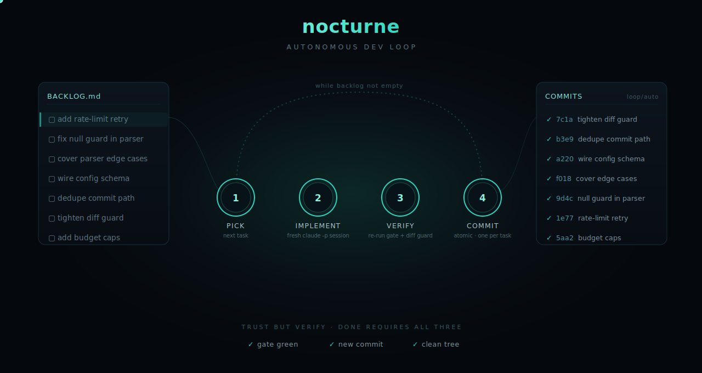

# nocturne


nocturne is a Claude Code skill that turns a repo plus a spec or checkbox-backlog into a self-verifying autonomous dev loop. A design-layer Claude reads the repo, authors a tailored harness, and launches a headless `claude -p` while-loop that implements, verifies, and commits each task on a dedicated branch.

*a task exists in a done/not-done superposition until the harness observes it.*

<p align="center">
  
</p>

## Why not just a loop?

"Define a loop and let it run" dies at the context window: one session working
a whole backlog drags every task's noise into the next, and quality decays as
the window fills. The actual fix is an outer loop that gives each task a fresh
session, carries state between sessions, and verifies results independently.
That is a real piece of engineering, not a prompt. nocturne is that outer loop: the
harness holds the backlog, budget, retries, and learnings; each task runs in a
clean headless `claude -p` session; nothing counts as done until the gate runs
green on a real commit.

## What it does

- **Auto-derived quality gate** - inferred from the repo, where an explicit `Done = <cmd>` statement outranks CI config, package scripts, and language defaults; the harness re-runs it independently.
- **Trust-but-verify** - done requires the gate green AND a real new commit AND a clean worktree; a self-report is never trusted.
- **Atomic commits** - one commit per task; failed attempts are fully discarded.
- **Rate-limit pause-resume** - a 429 never burns a retry; the loop sleeps to the reset and re-runs the same attempt.
- **Per-task model tiering** - with automatic retry escalation.
- **Anti-gaming diff guard** - rejects a green attempt that weakened a check or deleted an assertion instead of solving the task.
- **Acceptance criteria** - parsed from the backlog and enforced in the diff; non-codifiable ones are routed to a human checkpoint.
- **Budget guardrails** - dollar cap, wall-clock cap, per-task timeout, protected paths.
- **Observability** - a live in-terminal feed, a `.loop/report.md` dashboard, a global `~/.nocturne` run registry with statusline and events-feed surfaces, and a detached background mode.

## Install

One command. Installs the skill user-wide, so `/nocturne` works in every repo.

```bash
# macOS / Linux / WSL / Git Bash
curl -fsSL https://raw.githubusercontent.com/mreinhofferxd-pixel/nocturne/master/install.sh | bash
```

```powershell
# Windows / PowerShell 5.1+
irm https://raw.githubusercontent.com/mreinhofferxd-pixel/nocturne/master/install.ps1 | iex
```

A few seconds. Safe to re-run. Prefer a per-repo install? Copy
`.claude/skills/nocturne/` into the target repo's `.claude/skills/` instead.

## Quick start

You need the Claude Code CLI and `python` 3.10+ on PATH.

A `BACKLOG.md` is just checkbox tasks. One checkbox is one task is one commit:

```markdown
## parser hardening

- [ ] add a null guard in `parse_config`, with a test that pins it
- [ ] cover the empty-input and trailing-comma edge cases [complex]
- [ ] reject unknown keys @acceptance(test_rejects_unknown_keys passes)
```

`##` headings group tasks into units; a trailing `[simple|complex|very-complex]` tag
sets the model tier; `@acceptance(...)` pins a criterion the diff must satisfy. No
backlog yet? Point nocturne at a spec or design doc and it grooms one for you.

Then:

1. Open Claude Code in that git repo.
2. Run `/nocturne`.

The skill previews the backlog, gate, branch, and caps, then waits for an explicit
**GO** before launching. After GO it works the backlog unattended: implement, verify,
commit, repeat, until the backlog is empty or a cap is hit.

**Controls.** Watch it live in-session, or run `/nocturne watch` for a table across
all runs. Stop cleanly with `python .loop/orchestrator.py stop`; resume where it left
off by re-running `python .loop/orchestrator.py`; or launch it detached in the
background with `python .loop/orchestrator.py detach`.

The loop model runs with broad Bash access, so use it on repos you trust. Commits stay on a local loop branch; nothing is pushed.

## Configuration

nocturne auto-derives the gate, branch, and caps, so most runs need no config. The
skill writes its choices to `.loop/loop.config.json`; edit that file to override
before you type **GO**:

```json
{
  "gate": ["ruff check .", "pytest -q"],
  "budget": { "max_cost_usd": 5, "max_wallclock_min": 60 },
  "guardrails": { "protected_paths": [".env*", "secrets/**"] },
  "on_rate_limit": "pause-resume"
}
```

The full schema lives in `.claude/skills/nocturne/SKILL.md`.
